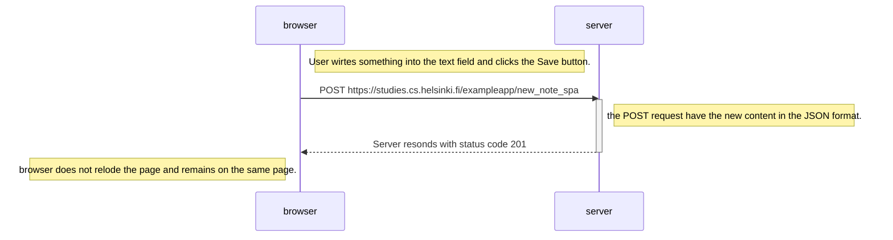

```mermaid
    sequenceDiagram
    participant browser
    participant server

    Note right of browser: User wirtes something into the text field and clicks the Save button.

    browser->>server: POST https://studies.cs.helsinki.fi/exampleapp/new_note_spa
    activate server
    Note right of server: the POST request have the new content in the JSON format.
    server-->>browser: Server resonds with status code 201
    deactivate server

    Note left of browser: browser does not relode the page and remains on the same page.


```
